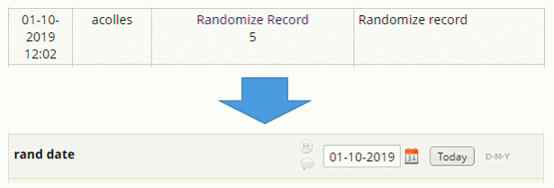

# Save Randomization Date 
Extracts the randomization date from the event log and saves it to a specified field in the project on page save.
<ul>
<li>Enables you to include the randomization date in the final dataset</li>
<li>Makes the randomization date accessible to standard reports, data quality rules and other REDCap functions.</li>
</ul>

<strong>
Nb. Please make sure that the date field is:
<ul>
<li>Validated as a date</li>
<li>Available at the event you select</li>
<li>Set as @READ-ONLY</li>
</ul>
</strong>