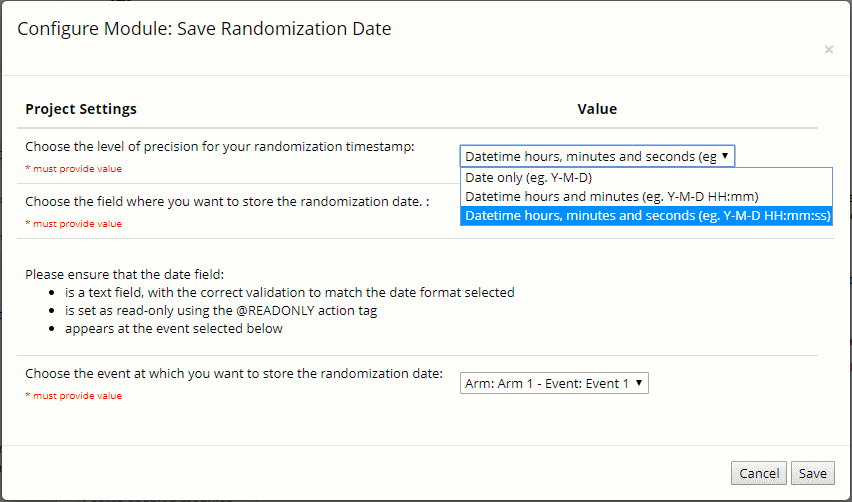

# Save Randomization Date 
Extracts the randomization timestamp from the event log and saves it to a specified field in the project on page save.
<ul>
<li>Enables you to include the randomization timestamp in the final dataset</li>
<li>Makes the randomization timestamp accessible to standard reports, data quality rules and other REDCap functions.</li>
</ul>

v1.1
-now allows you to specify the level of precision of the timestamp:

<strong>
Nb. Please make sure that the date/time field is:
<ul>
<li>Validated correctly for the level of precision you have selected.</li>
<li>Available at the event you select</li>
<li>Set as @READ-ONLY or @HIDDEN, to prevent it form being accidentally overwritten</li>
</ul>
</strong>